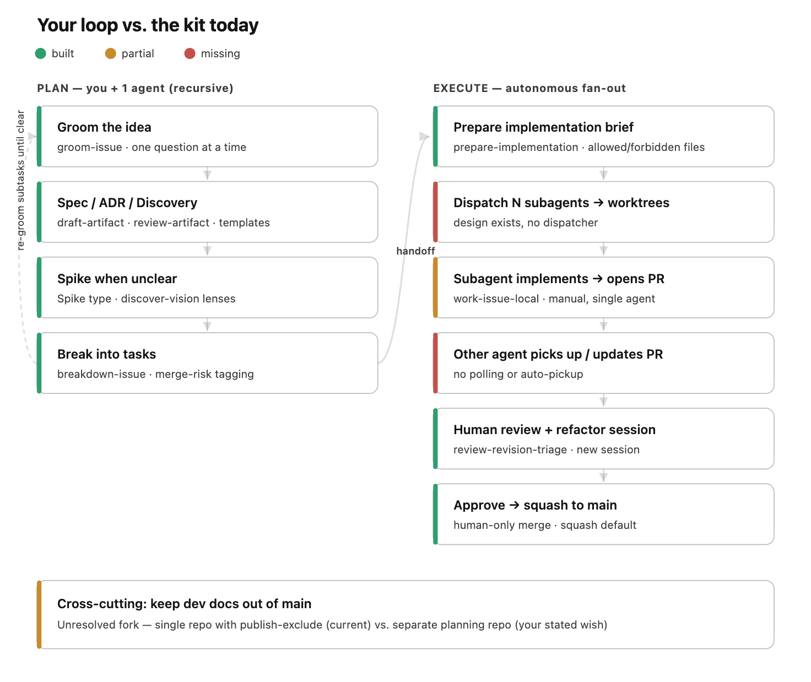

# Agent Workflow Kit

Status: seed repository.

This repository is a working kit for building a GitHub-native, agent-assisted development workflow.
It is the source repo for installable guidance, not an installed target of its own workflow.

Root `AGENTS.md` is intentionally source-repo guidance. It tells local agents not to recursively run
the kit workflow on this repository. The installable target-repo instructions live in
`kit/AGENTS.md`.



## Start Here

- Source-repo agent guidance: `AGENTS.md`
- Workflow draft: `docs/development/workflow/ai-dev-workflow.md`
- GitHub-first flow: `docs/development/workflow/github-first-flow.md`
- Install contract: `docs/development/workflow/installing-agent-workflow-kit.md`
- GitHub-first orchestration ADR: `docs/development/adrs/github-first-orchestration.md`
- Development docs policy: `docs/development/README.md`
- Installable agent instructions: `kit/AGENTS.md`
- Installable Codex skills: `kit/.agents/skills/` category folders

## Current Goal

Dogfood the kit against a separate project instead of improving it through a self-referential
workflow loop. The current playground is:

```text
/Users/joel/Dev/bullet-tetris-lab
branch: codex/empty-start
```

Use that Tetris game repository to test what the kit should help a real project do from a clean
state. Keep this repository focused on packaging the guidance, scripts, templates, and docs that
prove useful there.

For this source repo, use direct collaboration instead of the installed workflow loop: clarify with
the human, edit the source, run validation, and commit or push when asked. Do not create GitHub
issues, PRs, Project fields, or workflow state here unless the human explicitly asks for that.

The initial working assumption:

- single repository by default
- durable development artifacts under `docs/development/`
- GitHub Issues and PRs as collaboration and review surfaces
- local-first Codex agents
- repeated workflow verbs captured as installable skills
- high-interaction discovery for vague product/design direction before low-interaction execution
- deterministic CI only for now
- no Codex-in-CI baseline yet
- no autonomous merge

The root repo keeps only source-specific `AGENTS.md`. The installed `AGENTS.md` and installed skills
live under `kit/` so target repositories get the workflow while this source repo keeps its own
lighter self-improvement rules.

## Install Into Another Repo

GitHub-first workflow kit:

```bash
node scripts/install-workflow-kit.mjs --target /path/to/project
```

Proof from clean temporary repos:

```bash
node scripts/prove-portable-install.mjs
```
