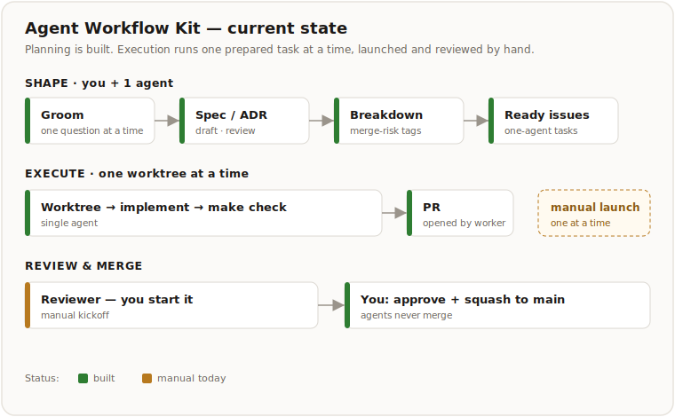
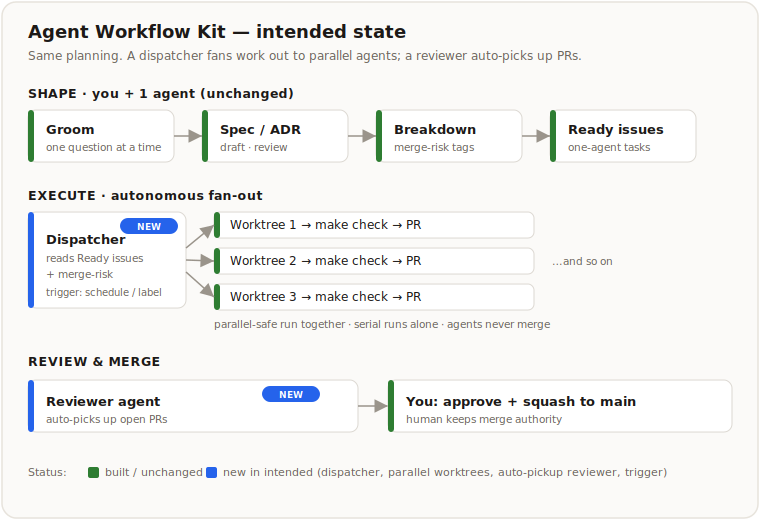

# Agent Workflow Kit

Agent Workflow Kit (AWK) is a GitHub-first workflow you install into a project so that AI agents and
humans plan, build, and review through the same durable state.

The core bet: **GitHub issues, PRs, and repo docs hold enough state that any agent — Codex, Claude,
or a human — can resume work without chat memory.** Agents execute prepared work and open small PRs.
Humans keep architecture, product, and merge decisions. Agents never merge.

This repository is the **source package** for the kit, not a project that runs the workflow on
itself. To use AWK, install it into another repository (below).

## What you get

- **Installable skills** (`kit/.agents/skills/awk/`) — the loop steps an agent runs: groom,
  break down, prepare, implement, review.
- **GitHub-first orchestration** — issues and PRs are the source of truth; no board or platform
  required to start.
- **Issue and PR templates** plus a label setup script.
- **Readiness and merge-safety discipline** — the part generic agents lack: every task ships with a
  goal, allowed/forbidden files, acceptance criteria, validation command, and a merge-risk tag so
  work is safe to hand to an autonomous agent.

## Start here

Run these from this kit repo, targeting the project you want to use AWK in.

```bash
# 1. Install the kit into your project (merges an AWK block into AGENTS.md; copies skills,
#    templates, and docs; refuses to overwrite different existing files).
node scripts/install-workflow-kit.mjs --target /path/to/your-project

# 2. In your project: push it to GitHub, then create the workflow labels.
cd /path/to/your-project
node scripts/setup-github-labels.mjs
```

Then, in your project, drive the loop by talking to your agent (Codex, Claude Code, etc.):

1. **Initialize** — ask the agent to use the `init-awk` skill. It verifies the repo is pushed,
   labels exist, and turns your plan into the first GitHub issues. No coding starts before this.
2. **Continue work** — ask the agent to *"continue work."* It reads issues, PRs, and repo docs via
   the `continue-work` skill and routes to the next step (groom → break down → prepare → implement →
   review).
3. **Review and merge** — you review each PR and merge with squash. Agents never merge.

That's the whole loop. You produce ready, well-bounded issues; the agent drains them into PRs; you
approve.

## The loop

```text
Intake -> Shape -> Execute -> Review -> Improve
```

`Shape` is the human-heavy part (grooming, specs/ADRs, breakdown into one-agent/one-PR tasks).
`Execute` is one prepared task → one worktree → one PR. `Improve` feeds lessons back into the kit.
Full operating rules live in `AGENTS.md` and `kit/docs/awk/` in this source repo; installed target
repos receive them under `docs/awk/`.

## What works today

- **Built:** the Shape loop (grooming, drafting, breakdown, readiness) and single-worker Execute →
  Review → merge handoff, driven from GitHub state.
- **Manual for now:** parallel fan-out across many worktrees. Run one worktree by hand first, then a
  small parallel batch. A thin local launcher is the next step — deliberately *not* a platform.

**Current state** — planning is built; execution runs one prepared task at a time, launched and reviewed by hand.



**Intended state** — same planning, but a dispatcher fans work out to parallel worktrees and a reviewer agent auto-picks up PRs. You keep approval and merge.



## Where the details live

| Path | Holds |
| --- | --- |
| `AGENTS.md` | Operating rules for agents working in this source repo. |
| `kit/` | The entire install payload copied into target repo roots. |
| `kit/AGENTS.md` | The minimal AWK block merged into each target project's `AGENTS.md`. |
| `kit/.agents/skills/awk/` | The installable workflow skills (the loop steps). |
| `kit/.github/` | Issue and PR templates copied into target repos. |
| `kit/docs/awk/` | Workflow reference, the GitHub-first ADR, and the install contract. |
| `kit/docs/development/README.md` | Installed target-project artifact folder contract. |
| `kit/scripts/` | Scripts copied into target repos. |
| `docs/development/` | This repo's own decisions, dogfood runs, and notes. |
| `scripts/` | Source-package installer and portable-install proof. |

## Working on the kit itself

Edit the source files directly, then validate. Commit or push only when asked.

```bash
node kit/scripts/validate-workflow.mjs
node scripts/prove-portable-install.mjs
```

See `AGENTS.md` for the source-repo rules (including how to dogfood the workflow in a separate target
repo rather than on this repo).
