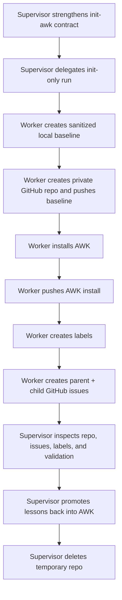
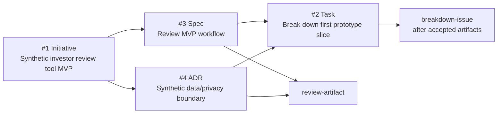

# AWK Init Bootstrap Dogfood

Date: 2026-06-22
Target: temporary private repo `jbelanger/awk-init-dogfood-2026-06-22`
Local target: `/Users/joel/Dev/awk-init-dogfood-2026-06-22`
Supervisor: main Codex thread
Delegated worker: Dewey (`019eef69-d7e6-7783-9c23-afac6af475a2`)

## Purpose

Test whether a delegated agent can run the new AWK initialization path without starting
implementation. This run specifically tested the rule that a pushed GitHub repo and persisted issues
must exist before any coding, branch fan-out, or PR work starts.

The source plan was deliberately sanitized. The worker was instructed not to copy personal finance
data, holdings, trades, reports, raw files, processed files, or CSVs from the local finance repo.

## Flow

## Results

Worker pushed two commits to the temporary repo:

- `6ef1ff3` Add synthetic investor review baseline
- `82d2113` Install Agent Workflow Kit

Validation from the target repo:

- `node scripts/validate-workflow.mjs`: passed
- `node scripts/setup-github-labels.mjs --repo jbelanger/awk-init-dogfood-2026-06-22 --verify-only`:
  initially failed because labels were missing, as expected
- `node scripts/setup-github-labels.mjs --repo jbelanger/awk-init-dogfood-2026-06-22`: created labels
- final label verification: passed

Supervisor verification:

- target repo was private
- default branch was `main`
- local target worktree was clean
- no PRs existed
- no coding branch existed
- no source code or app scaffold was created
- tracked files were limited to project-owned README/AGENTS, sanitized plan, AWK install files,
  templates, docs, and scripts
- privacy scan found only explicit synthetic/privacy-boundary language, not copied finance data

## Issue Bootstrap

The worker created four issues before implementation:

| Issue | Type | Intended next verb | Quality notes |
| --- | --- | --- | --- |
| `#1 [Initiative] Synthetic investor review tool MVP` | Initiative | `review-artifact` | Good parent issue. It links the sanitized plan, records non-goals, lists children, and states that the plan is not implementation-ready yet. |
| `#3 [Spec] Review synthetic MVP workflow and review packet semantics` | Spec | `review-artifact` | Good artifact-review routing. It explains why the detailed plan avoids `groom-issue` but still needs acceptance. |
| `#4 [ADR] Decide synthetic data and privacy boundary` | ADR | `review-artifact` | Good privacy/architecture gate. It uses `needs-human-review` and keeps real data out of scope. |
| `#2 [Task] Break down first prototype implementation slice` | Task | `breakdown-issue` | Correctly blocked on `#3` and `#4`; it does not route directly to implementation. |

## What Went Well

- The worker obeyed the main safety constraint: no coding, no PR, no implementation branch.
- The target `AGENTS.md` remained project-owned while AWK was installed as a marked block.
- AWK skills installed under `.agents/skills/awk/`.
- AWK process docs installed under `docs/awk/`.
- The detailed plan was converted to GitHub issues before downstream work.
- The first task was explicitly blocked on artifact/ADR acceptance, which avoided repeating the
  previous failure mode where coding began from local planning docs.

## What Was Weak

- The init protocol did not explicitly distinguish "accepted enough for artifact review or
  breakdown" from "accepted enough for implementation." The worker inferred the right distinction,
  but the skill should say it directly.
- Parent/child issue links require assigned issue numbers. The worker created and then corrected
  references, but the protocol should tell agents to create the parent first, create children
  sequentially, and update links afterward.
- The bootstrap still relies on manual `gh issue create` work. A future helper could reduce
  formatting drift, but the manual path is acceptable for now because it exposes what agents do.

## Lessons Promoted

Promoted back into the source kit during this run:

- `init-awk` now says accepted enough for artifact review or breakdown is not accepted enough for
  implementation.
- `init-awk` now says implementation still requires visible grooming, accepted direction, task
  boundaries, and an implementation brief or equivalent readiness record.
- `init-awk` and install docs now specify parent-first issue creation and post-creation link updates.
- `validate-workflow.mjs` now checks for those issue-bootstrap snippets.

## Cleanup

The temporary GitHub repo and local target checkout were created only for this dogfood run.

- Local checkout `/Users/joel/Dev/awk-init-dogfood-2026-06-22`: deleted after inspection.
- GitHub repo `jbelanger/awk-init-dogfood-2026-06-22`: deleted after the run.
