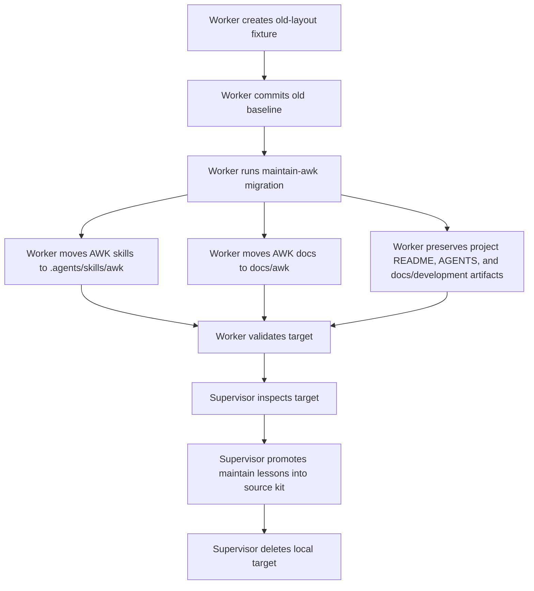

# AWK Maintain Migration Dogfood

Date: 2026-06-22
Target: local temporary repo `/Users/joel/Dev/awk-maintain-dogfood-2026-06-22`
Supervisor: main Codex thread
Delegated worker: Schrodinger (`019eef9e-efbb-7393-aaac-012a52efc22a`)

## Purpose

Test whether a delegated agent can migrate an existing older AWK install to the namespaced layout
without overwriting project-owned files or starting workflow execution.

This run tested `maintain-awk`, not `init-awk`. The target was local-only: no remote, issues, PRs,
branches, or application code were expected.

## Flow

## Results

Worker commits in the temporary target:

- `236e492` Create old-layout AWK baseline
- `8a44743` Migrate AWK install to namespaced layout

Validation:

- target `node scripts/validate-workflow.mjs`: passed
- source validator against target with `--cwd`: passed
- source `node scripts/validate-workflow.mjs`: passed
- source `node scripts/prove-portable-install.mjs`: passed

Supervisor verification:

- project-owned `README.md` was unchanged
- project-owned `AGENTS.md` guidance was preserved and the marked AWK block was updated
- project docs remained under `docs/development/`
- old AWK-owned paths were removed:
  - `.agents/skills/process`
  - `.agents/skills/specialist`
  - `.agents/skills/domain`
  - `docs/development/workflow`
  - `docs/development/adrs/github-first-orchestration.md`
- new AWK paths were present:
  - `.agents/skills/awk/{process,specialist,domain}`
  - `docs/awk/{workflow,adrs}`

## What Went Well

- The worker preserved project-owned README, AGENTS guidance, and development artifacts.
- The worker did not create issues, PRs, remotes, branches, or application code.
- The namespaced install layout validated in the migrated target.
- The marked `AGENTS.md` block was replaceable without erasing project-owned guidance.

## What Was Weak

- `scripts/install-workflow-kit.mjs` installs or merges the new layout, but it does not remove old
  AWK-owned paths. That is safer for the default installer, but `maintain-awk` must make cleanup
  explicit.
- Validation passed before it asserted that old AWK-owned root-level files were gone. A worker had
  to check those paths manually.

## Lessons Promoted

Promoted back into the source kit during this run:

- `maintain-awk` now has an explicit legacy cleanup step after install/repair.
- `maintain-awk` now says not to delete arbitrary project-owned skills or docs just because they
  live outside `.agents/skills/awk/`.
- `validate-workflow.mjs` now fails when known AWK-owned legacy files remain under old root-level
  skill/doc paths.

## Cleanup

The local target repo was created only for this dogfood run and was deleted after inspection.
