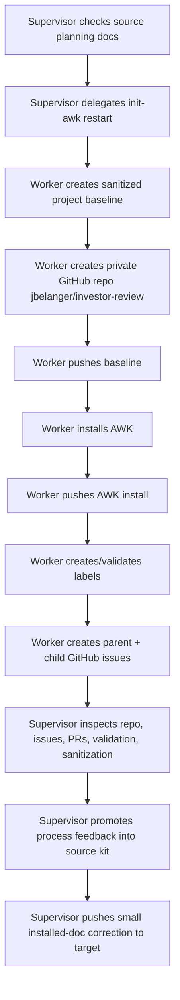
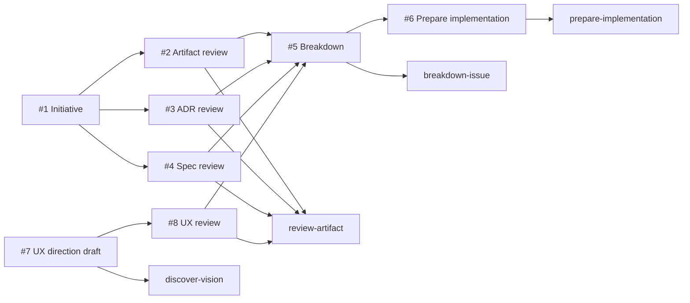

# Investor Review Bootstrap Dogfood

Date: 2026-06-22
Target remote: private repo `jbelanger/investor-review`
Target local checkout: `/Users/joel/Dev/investor-review-bootstrap`
Preserved previous failed-run checkout: `/Users/joel/Dev/investor-review`
Supervisor: main Codex thread
Delegated worker: Pauli (`019eefbb-abce-7e13-ae72-8a4207b4c05c`)

## Purpose

Restart the investor-review dogfood run with the stabilized AWK flow:

1. create a fresh pushed repo;
2. install AWK under `.agents/skills/awk/` and `docs/awk/`;
3. preserve project-owned `README.md` and `AGENTS.md`;
4. create labels;
5. create GitHub issues from the detailed plan before any coding;
6. stop before implementation.

The canonical local path `/Users/joel/Dev/investor-review` was already occupied by the earlier
failed run with uncommitted implementation work. The new local checkout used
`/Users/joel/Dev/investor-review-bootstrap` while the GitHub repo used the canonical
`jbelanger/investor-review` name.

## Flow

## Target Commits

Pushed to `jbelanger/investor-review`:

- `42314ff` Initialize sanitized investor review planning baseline
- `1b52588` Install Agent Workflow Kit
- `ad216ce` Clarify development docs ownership
- `56f4fbc` Apply UX gate and lazy artifact folders

The final commit was a supervisor-applied install-artifact correction after the worker noticed that
the installed `docs/development/README.md` still sounded source-package-specific.
The later `56f4fbc` commit applied the source-kit UX readiness gate and removed unused
`docs/development/*/.gitkeep` placeholders from the target.

## Validation

Target validation:

- `node scripts/validate-workflow.mjs`: passed
- `node scripts/setup-github-labels.mjs --verify-only`: passed
- `git diff --check HEAD`: passed before the supervisor correction commit

Supervisor verification:

- remote repo is private
- branch `main` is pushed
- local target worktree is clean after the correction commit
- no PRs exist
- no coding branches exist
- no source code, app scaffold, fixtures, or implementation files were created
- AWK skills are under `.agents/skills/awk/`
- AWK process docs are under `docs/awk/`
- project-owned durable docs are under `docs/development/`

## Sanitization

The worker created only sanitized planning docs:

- `docs/development/product-brief.md`
- `docs/development/architecture-brief.md`
- `docs/development/domain-language.md`
- `docs/development/walking-skeleton-plan.md`
- `docs/development/sanitization-notes.md`

The supervisor privacy scan found safety/privacy-boundary language and generic domain vocabulary,
but no copied holdings exports, trade files, raw/processed CSVs, account values, position sizes, or
ticker-level holdings lists.

## Issue Bootstrap

The worker created six initial issues before implementation:

| Issue | Type | Next workflow verb | Quality notes |
| --- | --- | --- | --- |
| `#1 Initialize investor review walking skeleton from sanitized plan` | Initiative | `review-artifact` | Parent issue. Explicitly says the plan is detailed enough for artifact review, not implementation. |
| `#2 Review sanitized planning artifacts for first workflow pass` | Spec/artifact review | `review-artifact` | Reviews imported docs as the authoritative starting artifact set. |
| `#3 Review ADR direction for local-first Python contract spine` | ADR | `review-artifact` | Reviews architecture direction before breakdown. |
| `#4 Review spec scope for first contracts and sanitized fixture` | Spec | `review-artifact` | Reviews minimum contract/fixture semantics before breakdown. |
| `#5 Break down the first walking skeleton into prepared task candidates` | Task | `breakdown-issue` | Blocked on artifact/ADR/spec/UX review; does not route to implementation. |
| `#6 Prepare implementation brief for the first approved skeleton task` | Task | `prepare-implementation` | Blocked on breakdown and UX readiness for any UI-bearing work; does not route to implementation. |
| `#7 Define UX direction for the first investor review workflow` | Discovery | `discover-vision` | Reframed as agent-owned UX draft work with generated mockups before human review. |
| `#8 Review UX direction and mockups` | Discovery review | `review-artifact` | Human review gate for accepting or revising the UX direction and visual aids produced by `#7`. |

## What Went Well

- The worker did not start coding.
- The worker created durable GitHub issues before implementation.
- The issue surface reflects the detailed-plan path rather than vague-idea discovery.
- The first executable task path is intentionally gated: review artifacts, then breakdown, then
  prepare implementation.
- The previous failed local checkout was preserved.
- The remote has the intended canonical name `investor-review`.
- A UX gate was added before breakdown/preparation because the product will have a UI.
- The later `#7` test drive successfully produced a PR-visible UX discovery bundle before human
  review, which better matches the lazy-human path.

## What Was Weak

- Installed `.github/ISSUE_TEMPLATE/config.yml` had an extra trailing blank line that triggered
  `git diff --check` in the target. The worker fixed it locally.
- Installed `docs/development/README.md` still used source-package wording that mentioned
  `kit/AGENTS.md` and `kit/.agents/skills/awk/`, which is confusing inside a target repo.
- The installer created empty `docs/development/{adrs,discovery,specs,spikes}` folders via
  `.gitkeep`, even though those folders should exist only after real project artifacts exist.
- The first issue surface did not initially include a UX-direction gate, even though the product is
  expected to have a UI.
- The boundary between `.agents/skills/awk/`, `docs/awk/`, and `docs/development/` needed to be
  explicit. Moving all process docs into skill folders would hide human-readable workflow docs and
  make skills carry too much reference material.
- The first UX-gate wording could sound like the human had to produce UX direction from scratch,
  when the better flow is for a discovery or UX-direction agent to draft direction for human review.
- UX direction needs visual aids for UI products. Text-only UX direction leaves too much for the
  human to imagine and makes it harder to compare assumptions before implementation starts.
- Visual artifact QA needs rendered-preview checks. The delegated worker's SVGs passed XML and
  whitespace validation while the first rendered previews still clipped important content.
- The issue chain needed a separate review issue. Keeping `needs-human-review` on the drafting issue
  made the human look like the blocker before an agent had produced anything to review.

## Lessons Promoted

Promoted back into the source kit during this run:

- Removed the extra blank line from `.github/ISSUE_TEMPLATE/config.yml`.
- Reworded `docs/development/README.md` so it works in both target projects and the AWK source repo.
- Pushed the corrected `docs/development/README.md` to the target repo as commit `ad216ce`.
- Removed empty development artifact folder creation from the installer and validation contract.
- Added a proportional UX readiness gate for UI-bearing work to the workflow docs and implementation
  readiness skills.
- Added issue `#7` and comments on `#1`, `#5`, and `#6` so future agents know UX direction gates
  any UI-bearing implementation.
- Kept AWK process references under `docs/awk/`, added `docs/awk/README.md`, and clarified that
  executable AWK skills stay under `.agents/skills/awk/` while project-specific artifacts stay under
  `docs/development/`.
- Clarified that UX discovery should prepare a compact direction draft for human review, asking one
  blocking question only when the next direction cannot be drafted responsibly.
- Added a generated visual artifact path for UX discovery and UX specs. Discovery workers can now
  create non-production mockups or sample assets under `docs/development/discovery/<slug>/mockups/`,
  while UX specs can keep linked visuals under `docs/development/specs/<slug>-assets/`.
- Pushed the target repo update as commit `67305e8` and commented on `#7` to request mockups for
  the investor review queue, review detail, and loading/error/replay states.
- Added rendered-preview validation guidance to AWK discovery and drafting instructions after the
  UX worker needed two visual revisions for right-edge clipping.
- Reframed `#7` as agent-owned discovery, created `#8` as the human `review-artifact` gate, and
  opened target PR `#9` with the UX discovery bundle and mockups.

## Current State

The investor-review repo has target PR `#9` open for UX artifact review. The next natural route is
`review-artifact` on issue `#8` for PR `#9`, alongside artifact review on issues `#2`, `#3`, and
`#4`. UI-bearing `breakdown-issue` on `#5` remains blocked until the UX direction is accepted or
explicitly scoped out of the first slice.
