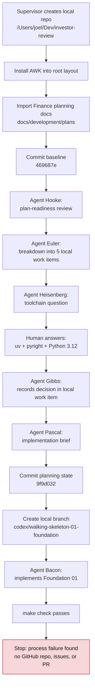
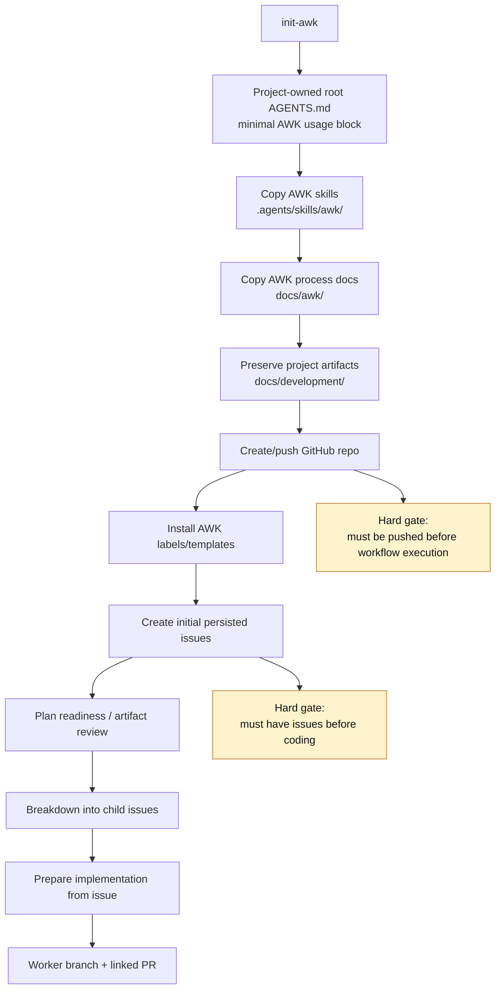

# Investor Review Dogfood Run - 2026-06-22

Status: stopped after process failure was identified

## Summary

This run tested the detailed-plan path using `/Users/joel/Dev/investor-review` as the target repo.
It proved that agents can follow a detailed plan through readiness review, breakdown,
implementation preparation, and bounded implementation. It also exposed a blocking workflow flaw:
the run started development before a pushed GitHub repo, GitHub issues, and issue-linked artifacts
existed.

The implementation worker passed `make check`, but the workflow should not have reached code in this
state. AWK needs an initialization path that creates an encapsulated kit install, pushes the target
repo, configures labels, and creates persisted issues before execution begins.

## Target State

- Target repo path: `/Users/joel/Dev/investor-review`
- Source plan path: `/Users/joel/Dev/perso/Finance`
- Baseline commit: `469687e Create detailed-plan dogfood baseline`
- Planning commit: `9f9d032 Add walking skeleton work breakdown`
- Active branch when stopped: `codex/walking-skeleton-01-foundation`
- Remote GitHub repo: none
- GitHub issues: none
- Pull request: none

## Visual - Actual Flow



## Visual - Expected Gate Before Coding



## Agents Involved

| Agent | Role | Output | Protocol result |
| --- | --- | --- | --- |
| Supervisor | Orchestrated and monitored | Created local repo, delegated steps, stopped run | Failed to require GitHub remote/issues before execution |
| Hooke | Plan-readiness reviewer | `plan-readiness-review.md` | Correctly routed detailed plan to `breakdown-issue`, not discovery |
| Euler | Breakdown agent | 5 walking-skeleton child work items | Correctly decomposed into sequenced work |
| Heisenberg | Narrow grooming agent | Toolchain decision question | Correctly asked one blocking question |
| Gibbs | Decision recorder | Updated Foundation 01 toolchain decision | Correctly recorded human answer only |
| Pascal | Implementation-prep agent | Foundation 01 implementation brief | Correctly produced brief, no code |
| Bacon | Implementation worker | Foundation 01 code/check surface | Stayed in scope and passed validation |

## Parallelism

No parallel implementation tasks were run.

This was sequential by design because Foundation 01 was marked `Serial only` and blocked all later
walking-skeleton slices. Parallel work would only become valid after Foundation 01 lands and the
next child items have issue-linked implementation briefs.

## Artifacts Created In Target Repo

Committed planning artifacts:

- `docs/development/work-items/plan-readiness-review.md`
- `docs/development/work-items/walking-skeleton-01-foundation-check-surface.md`
- `docs/development/work-items/walking-skeleton-01-foundation-implementation-brief.md`
- `docs/development/work-items/walking-skeleton-02-append-only-record-spine.md`
- `docs/development/work-items/walking-skeleton-03-fixture-ingestion.md`
- `docs/development/work-items/walking-skeleton-04-technical-scoring.md`
- `docs/development/work-items/walking-skeleton-05-replay-cli-integration.md`

Uncommitted implementation artifacts on `codex/walking-skeleton-01-foundation`:

- `pyproject.toml`
- `uv.lock`
- `Makefile`
- `src/investor_review/__init__.py`
- `src/investor_review/contracts/**`
- `src/investor_review/core/**`
- `tests/contract/test_contract_schema_versions.py`
- `tests/architecture/test_dependency_rules.py`
- modifications to `.gitignore`
- modifications to `README.md`

Validation result from the implementation worker and supervisor check:

```text
make check: passed
ruff check: passed
ruff format --check: passed
pyright: 0 errors
pytest tests/contract: 3 passed
pytest tests/architecture: 1 passed
make replay: import-only reserved smoke target passed
```

## What Went Well

- The detailed-plan route worked better than vague discovery for this project.
- The plan-readiness agent correctly avoided restarting discovery.
- The breakdown agent created useful sequenced child work items from existing accepted direction.
- The toolchain decision was surfaced as a narrow human decision instead of guessed.
- The implementation brief gave the worker a clear boundary.
- The implementation worker stayed inside the allowed file scope and did not implement later slices.
- Validation passed quickly with the chosen `uv` + `pyright` + Python 3.12 toolchain.

## What Went Badly

- The supervisor allowed execution before the target had a pushed GitHub repo.
- There were no GitHub issues before breakdown, implementation prep, or coding.
- Local Markdown work items became a substitute for the GitHub issue flow instead of temporary
  source material to convert into issues.
- The installed kit overwrote root-level project identity too aggressively:
  - root `AGENTS.md` became AWK-owned instead of project-owned;
  - skills were installed as general `.agents/skills/process/*` instead of visibly under
    `.agents/skills/awk/*`;
  - AWK process docs were mixed into `docs/development/workflow/*` instead of encapsulated under
    `docs/awk/*`.
- The run had no issue-linked PR surface, so review and handoff could not be tested properly.

## Decisions From This Review

- AWK skills should install under `.agents/skills/awk/`.
- AWK process docs should install under `docs/awk/`.
- Permanent project artifacts should remain in `docs/development/`.
- Root `AGENTS.md` should stay project-owned and contain only the minimal AWK usage instruction.
- Root `README.md` should stay project-owned.
- A pushed GitHub repo is mandatory before AWK workflow execution.
- Initial local work-item docs should be converted to GitHub issues before implementation starts.
- New skills are needed:
  - `init-awk`: install AWK into an existing or new project without taking over project identity,
    require/push GitHub remote, install labels, and create initial issues.
  - `maintain-awk`: update or repair an existing AWK install while preserving project-owned files.

## Route Classification

This was not a grooming/discover-vision run.

| Workflow step | Happened? | Notes |
| --- | --- | --- |
| Groom vague idea | No | Source plan was already detailed. |
| Discover vision | No | Correctly skipped. |
| Plan readiness review | Yes | Created local readiness note. |
| Breakdown | Yes | Created 5 local child work items. |
| Narrow grooming | Yes | Toolchain decision only. |
| Prepare implementation | Yes | Created Foundation 01 brief. |
| Work issue local | Yes, too early | Worker implemented before issue/PR flow existed. |
| Review local changes | No | Stopped before review due process failure. |
| PR handoff | No | No remote GitHub repo. |

## Comparison Metrics For Future Runs

| Metric | This run | Desired next run |
| --- | --- | --- |
| AWK installed under `.agents/skills/awk/` | No | Yes |
| AWK docs under `docs/awk/` | No | Yes |
| Project-owned root `AGENTS.md` | No | Yes |
| Pushed GitHub repo before workflow | No | Yes |
| Initial issues before coding | No | Yes |
| Child tasks represented as GitHub issues | No | Yes |
| Implementation linked to issue | No | Yes |
| PR opened for worker output | No | Yes |
| Worker stayed within scope | Yes | Yes |
| Validation passed | Yes | Yes |

## Recommended Next Run Setup

Start fresh after implementing `init-awk` or a manual equivalent:

1. Create a new local target repo.
2. Add a project-owned `README.md` and root `AGENTS.md`.
3. Install AWK under `.agents/skills/awk/` and `docs/awk/`.
4. Push the repo to GitHub before workflow execution.
5. Install labels/templates.
6. Convert imported plan and walking-skeleton tasks into GitHub issues.
7. Only then delegate plan-readiness, breakdown, implementation prep, worker branch, and PR.

## Open Process Questions

- Should local Markdown work items remain allowed as a fallback, or should AWK require GitHub issues
  whenever a remote is available?
- Should `init-awk` create the first parent issue from an imported plan automatically?
- Should `maintain-awk` be responsible for migrating older root-level AWK installs into the
  namespaced layout?
